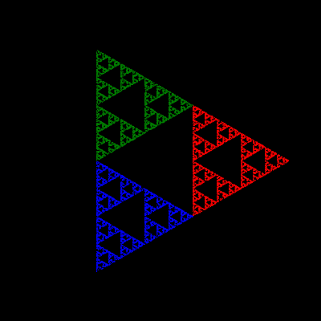

# Chaos Game

This demonstration was inspired by the [Chaos Game](https://www.youtube.com/watch?v=kbKtFN71Lfs) video by [Numberphile](https://www.youtube.com/channel/UCoxcjq-8xIDTYp3uz647V5A). General information is available from [Wikipedia](https://en.wikipedia.org/wiki/Chaos_game).

The basic idea is that starting with a polygon, a fractal pattern will emerge within by repeatedly moving a fixed proportion (in this case, halfway) towards a randomly selected vertex and marking the resulting point.

To view, clone the repo and open index.html in your browser. Controls are provided to select the number of vertexes (which will restart the generation), loops per update (which affects rendering speed), play, pause and restart.

Here's how a triangle can end up looking:

